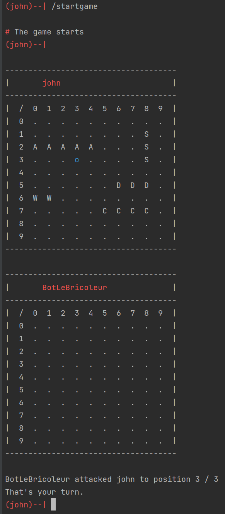
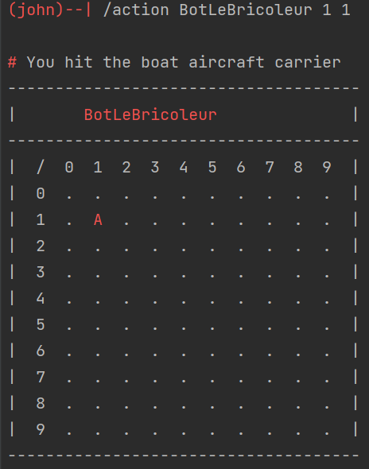

# Bataille Navale (2022-2023)
## Groupe

- Lazare K ASSIE
- Maximilien DENIS
- Ludivic GILOTAUX
- Alexandre Ernotte

## Introduction

Ce projet est développé dans le cadre du cours de "Programmation Orienté Objet" en Bac 2 Informatique de Gestion  à l'ESA. Ce dernier est exclusivement écrit en Java et doit répondre à certaines contraintes qui sont les suivantes :

- Implémenter un jeu de touché coulé Client - Serveur
- Utilisation du réseau
- Combat Client - Client
- Combat Client - Serveur
- Proposition de plusieurs plateaux de tailles différentes
- Possibilités de jouer à plusieurs : 2 - 3 - 4 joueurs
- Possibilités de jouer par équipes : 2 contre 2
- Possibilités de suivre des parties auxquelles on ne joue pas
- Partie avec des horloges

## Les rôles

Il y a plusieurs rôles mais pour l'instant, seulement 2 sont disponibles :

- UNDEFINED
- ADMIN


## Les commandes client

Pour envoyer un message au serveur, il faut avant tout se connecter... Si vous souhaitez connaître la syntaxe de la commande à envoyer il suffit d'envoyer `/help`. Faites attention que si vous êtes inactif plus de 5 minutes, le serveur vous déconnecte automatiquement. De plus, certaines commandes sont accessibles uniquement sous certaines conditions :

- Le rôle de l'utilisateur
- L'état de connexion du client

### Commandes disponibles sans être authentifié

|Commande|Description|Role|
|-|-|-|
|`/help`|liste les commande disponibles|UNDEFINED|
|`/signin <username> <password>`|connexion à un utilisateur existant |UNDEFINED |
|`/signup <username> <password>`|création d'un nouvel utilisateur|UNDEFINED|
|`/ping`|ping le serveur|UNDEFINED|

### Commandes disponibles après authentification

| Commande                        | Description                                                  | Role      |
| ------------------------------- | ------------------------------------------------------------ | --------- |
| `/userlist`                     | liste l'ensemble des utilisateurs existants sur le serveur   | ADMIN     |
| `/invite <username>`            | envoie une invitation à un utilisateur du serveur            | ADMIN     |
| `/confirm <username>`           | confirme une invitation d'un utilisateur provenant du serveur | ADMIN     |
| `/signout`                      | se déconnecte du serveur                                     | ADMIN     |
| `/help`                         | liste les commande disponibles                               | UNDEFINED |
| `/signin <username> <password>` | connexion à un utilisateur existant                          | UNDEFINED |
| `/signup <username> <password>` | création d'un nouvel utilisateur                             | UNDEFINED |
| `/ping`                         | ping le serveur                                              | UNDEFINED |

## Préparation de la partie

Au préalable, il est nécessaire de créer 2 bots.

```
(john)--| /createbot robot
(john)--| /createbot droid
```

### Lancer une partie entre bots

C'est possible de visualiser les utilisateurs sur le serveurs ainsi que les bots avec la commande `/userlist`.
Pour simuler la partie, il faut envoyer la commande suivante.

```
(john)--| /simulategame robot droid
```

La partie tourne en arrière-plan et les 2 bots s'affrontent. Une fois que la partie est terminée, une victoire est ajoutée au joueur gagnant et une défaite au joueur perdant.

### Lancer une partie contre un ou plusieurs bot(s)

Pour jouer contre des bots, il faut les inviter. La partie va se créer et ajouter `john` ainsi que les bots `robot` et `droid`. Pour les inviter, il faut exécuter les commandes suivantes.

```
(john)--| /invite robot
(john)--| /invite droid
```

Ici, le joueur `john` a invité les 2 bots. Pour lancer la partie, il faut envoyer la commande suivante.

```
(john)--| /start
```

### Lancer une partie contre un ou plusieurs joueur(s)

Pour jouer contre des joueurs, c'est la même chose que les bots.

```
(john)--| /invite jane
(jane)--| /invite erik
```

Ici, `john` crée une partie en invitant `jane` et `jane` invite à son tour `erik` dans la partie.
Une fois que tout le monde est là, la partie peut commencer en envoyant la commande suivante. Cette dernière peut être envoyée par n'importe quel joueur.

```
(erik)--| /start
```

Il est possible de jouer à la fois avec des personnes et des bots car ils sont tous considérés comme des joueurs.

## Déroulement de la partie

La partie commence lorsque le serveur sélectionne au hasard un des joueurs. Le message suivant lui est envoyé.



Dans cette partie, il n'y a que la personne `john` et le bot `BotLeBricoleur`. On peut voir que le bot a été le premier à jouer. Pour envoyer un coup, il faut spécifier  le joueur ciblé ainsi que la ligne et la colonne de la case visée comme la commande qui suit.

```
(john)--| /action BotLeBricoleur 1 1
```



On peut voir que `john` a touché le porte-avion de `BotLeBricoleur` !
C'est possible de se déconnecter de sa session en faisant `/signout` puis de revenir plus tard continuer la partie.
Tant que la partie n'est pas terminée, les joueurs s'y trouvant ne peuvent pas en démarrer une nouvelle.
